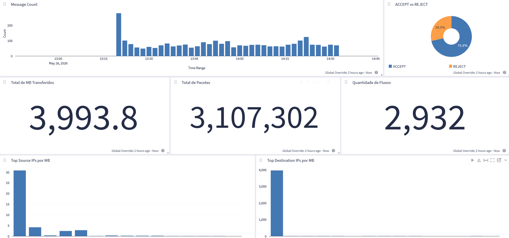

# OCI Graylog Network Logs

Stack Terraform para OCI Resource Manager que cria uma VM Oracle Linux 9, instala o Graylog em Docker e automatiza a ingestão de logs de rede da OCI arquivados no Object Storage.

[](https://cloud.oracle.com/resourcemanager/stacks/create?zipUrl=https://github.com/phspontes/oci-graylog-network-logs/releases/latest/download/oci-graylog-network-logs.zip)

## Isenção de responsabilidade

Antes de continuar, tenha em mente que a utilização de qualquer script, código ou comando contido neste repositório é de sua total responsabilidade, não cabendo aos autores dos códigos nenhum ônus sobre qualquer utilização do conteúdo aqui disponível.

Teste adequadamente todo o conteúdo em ambiente apropriado e integre os scripts de automação a uma infraestrutura de monitoramento, para que seja possível acompanhar o funcionamento do processo de automação e mitigar possíveis falhas.

Este não é um aplicativo oficial da Oracle e, por isso, não conta com o seu suporte. A Oracle não se responsabiliza por nenhum conteúdo aqui presente.

## O que a stack faz

- Cria uma VM Oracle Linux 9 em uma VCN/subnet existente.
- Permite selecionar VCN e subnet em compartments diferentes.
- Usa, por padrão, o shape `VM.Standard.E5.Flex` com 1 OCPU, 12 GB de RAM e disco de boot de 100 GB.
- Permite informar um IP privado fixo para a VM; se vazio, a OCI aloca automaticamente.
- Cria um Network Security Group expondo somente `22/tcp` para SSH e `9000/tcp` para a interface web do Graylog.
- Instala Docker Engine, Graylog `7.1`, Graylog Data Node e MongoDB via Docker Compose.
- Configura o Data Node com certificado self-signed automatizado e heap calculado como metade da RAM da VM.
- Desabilita a telemetria do Graylog.
- Cria um input GELF HTTP local em `127.0.0.1:12202`.
- Instala um coletor Python via systemd para ler logs arquivados no Object Storage usando Instance Principal.
- Limita, por padrão, o processamento a objetos modificados nos últimos 7 dias. Use `0` para não limitar por idade.
- Importa automaticamente um Content Pack com dashboards para análise de VCN Flow Logs.

## Prévia do dashboard



## Arquitetura

```text
OCI Logging / VCN Flow Logs
        |
        v
Service Connector Hub
        |
        v
Object Storage Bucket
        |
        v
Coletor Python na VM, via Instance Principal
        |
        v
Graylog GELF HTTP local, 127.0.0.1:12202
        |
        v
Dashboards Graylog
```

## Configurações manuais necessárias

Antes de executar a stack, você deve criar e configurar manualmente na OCI:

- o bucket Object Storage que receberá os logs;
- a habilitação dos VCN Flow Logs nos recursos de rede desejados;
- o Service Connector Hub enviando os logs do OCI Logging para o bucket;
- as regras de rota e segurança necessárias para a VM acessar internet/serviços OCI;
- as permissões IAM para leitura do bucket, caso não use a opção automática de Dynamic Group e Policy da stack.

A stack parte do pressuposto de que os logs já estão sendo gravados no bucket informado. Ela provisiona o Graylog, o coletor e os dashboards, mas não cria o pipeline de geração/exportação dos VCN Flow Logs.

## Como usar

1. Clique em **Deploy to Oracle Cloud** no início deste README.
2. Escolha o compartment onde a stack do Resource Manager será criada.
3. Preencha os parâmetros solicitados no formulário.
4. Revise o plano do Terraform.
5. Execute o job **Apply**.
6. Aguarde o término do cloud-init na VM.
7. Acesse o Graylog pela URL exibida no output `graylog_url`.

## Pré-requisitos

- VCN e subnet existentes na OCI.
- Chave pública SSH para acesso ao usuário `opc`.
- Bucket Object Storage criado manualmente.
- VCN Flow Logs habilitados manualmente nos recursos de rede desejados.
- Service Connector Hub configurado manualmente para enviar os logs ao bucket.
- Permissão para criar VM, VNIC, Network Security Group e, opcionalmente, Dynamic Group/Policy.
- Regras de rota e segurança permitindo acesso de saída da VM à internet ou aos serviços necessários da OCI.

## Parâmetros principais

- `instance_compartment_ocid`: compartment onde a VM será criada.
- `vcn_compartment_ocid`: compartment da VCN.
- `subnet_compartment_ocid`: compartment da subnet.
- `vcn_ocid` e `subnet_ocid`: rede onde a VM será criada.
- `private_ip`: IP privado opcional da VM.
- `ssh_public_key`: chave pública SSH para o usuário `opc`.
- `ssh_source_cidr`: origem permitida para SSH.
- `graylog_source_cidr`: origem permitida para acesso web ao Graylog.
- `oci_log_bucket_compartment_ocid`: compartment do bucket de logs.
- `oci_log_bucket_name`: bucket com logs arquivados pelo Service Connector Hub.
- `oci_log_object_prefix`: prefixo opcional dos objetos no bucket.
- `oci_log_max_object_age_days`: processa somente objetos modificados nos últimos N dias; `0` desativa o limite.
- `create_iam_policy`: cria Dynamic Group e Policy automaticamente, se habilitado, com acesso restrito ao bucket informado.

## IAM

A VM usa Instance Principal para ler os objetos do bucket. A stack possui a opção `Criar Dynamic Group e Policy`.

Quando habilitada, a stack cria:

- um Dynamic Group restrito ao OCID da VM;
- uma Policy no compartment do bucket;
- permissão limitada ao nome do bucket informado com `where target.bucket.name`.

Quando desabilitada, a VM grava a sintaxe recomendada em:

```bash
sudo cat /root/graylog-oci-iam-policy.txt
```

Exemplo de policy:

```text
Allow dynamic-group <dynamic-group-graylog> to inspect buckets in compartment id <compartment-do-bucket> where target.bucket.name = '<nome-do-bucket>'
Allow dynamic-group <dynamic-group-graylog> to read objects in compartment id <compartment-do-bucket> where target.bucket.name = '<nome-do-bucket>'
```

## Acesso ao Graylog

O output `graylog_url` mostra a URL do Graylog na porta `9000`.

Credenciais iniciais:

```text
Usuário: admin
Senha inicial: OCID da instância
```

Na VM, o mesmo resumo fica disponível em:

```bash
sudo cat /root/graylog-access.txt
```

## Operação e logs

Acompanhar o cloud-init:

```bash
sudo tail -f /var/log/cloud-init-output.log
sudo cloud-init status --long
```

Acompanhar os containers:

```bash
cd /opt/graylog
sudo docker compose ps
sudo docker compose logs -f graylog
```

Acompanhar o coletor de logs:

```bash
sudo systemctl status oci-object-logs-to-graylog
sudo journalctl -u oci-object-logs-to-graylog -f
```

## Arquivos baixados pela VM

Durante o cloud-init, a VM baixa estes arquivos deste repositório:

```text
https://raw.githubusercontent.com/phspontes/oci-graylog-network-logs/refs/heads/main/scripts/oci_object_storage_logs_to_graylog.py
https://raw.githubusercontent.com/phspontes/oci-graylog-network-logs/refs/heads/main/scripts/oci-vcn-flow-dashboard-final.json
```

As URLs podem ser sobrescritas no schema do Resource Manager, se necessário.

## Estrutura do repositório

```text
oci-graylog-network-logs/
  main.tf
  variables.tf
  outputs.tf
  schema.yaml
  cloud-init.yaml.tftpl
  README.md
scripts/
  oci_object_storage_logs_to_graylog.py
  oci-vcn-flow-dashboard-final.json
  README-oci-object-storage-logs-to-graylog.md
docs/
  dashboard-preview.png
```
